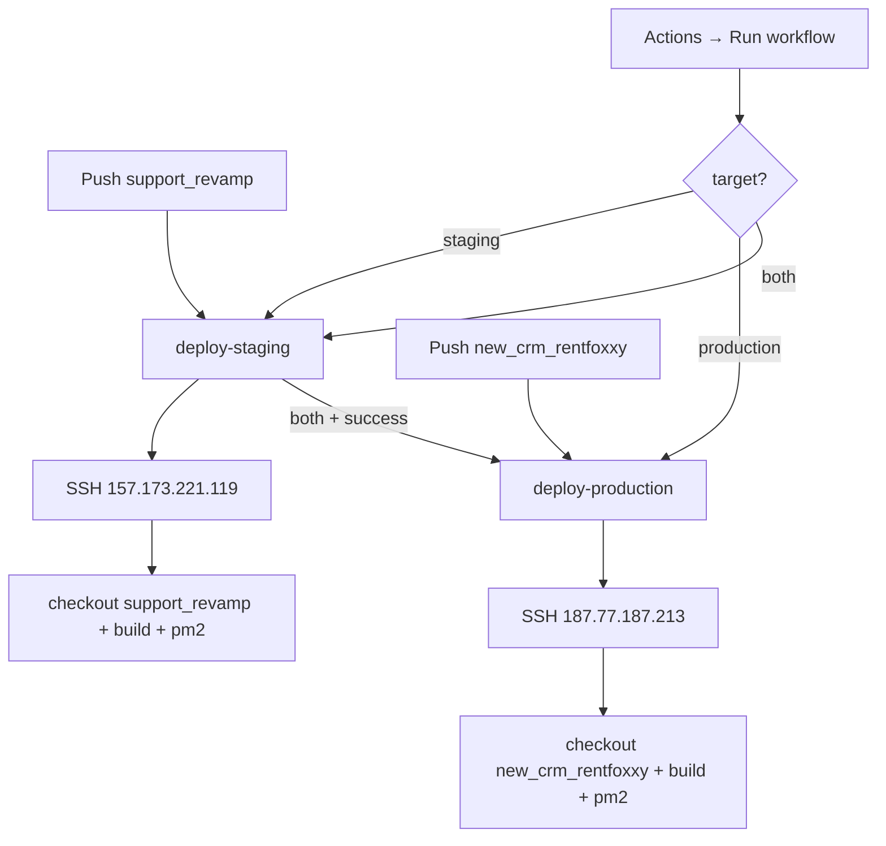

# CI/CD — GitHub Actions → Dual VPS (staging + production)

Two branches deploy to two servers. Infrastructure, domains, and PM2 setup stay the same.

| Environment | Server | Branch | Path | When it deploys |
|-------------|--------|--------|------|-----------------|
| **staging** | `157.173.221.119` | `support_revamp` | `/var/www/crm_rentfoxxy_staging` | Push to `support_revamp`, or manual |
| **production** | `187.77.187.213` | `new_crm_rentfoxxy` | `/var/www/crm_rentfoxxy` | Push to `new_crm_rentfoxxy`, or manual |

| Domain (typical) | App |
|------------------|-----|
| https://staging.rentfoxxy.com | Admin CRM (`frontend`) |
| https://staging.rentfoxxy.com/api | Backend API (`backend`) |
| https://customer.rentfoxxy.com | Customer portal |
| https://vendor.rentfoxxy.com | Vendor portal |

**Workflow file:** `.github/workflows/deploy.yml`  
**PM2 (staging):** process id / name as configured on `157` (workflow restarts `5`)  
**PM2 (production):** `crm-backend`  
**Each VPS keeps its own** `backend/.env` (DB, URLs, API keys).

---

## Deployment flow



**Concurrency:** One deploy group at a time (`deploy-crm-rentfoxxy`).  
**Safety:** Remote script uses `set -euo pipefail`. If install/build fails, PM2 is not restarted.

---

## 1. GitHub Environments + Secrets

### Create environments

GitHub → **Settings → Environments** → create:

1. `staging`
2. `production` (recommended: enable **Required reviewers** so prod needs approval)

### Secrets on **each** environment

Add these three secrets **inside** the environment (not only at repo level), with **different values** per server:

| Secret | Staging example | Production example |
|--------|-----------------|--------------------|
| `VPS_HOST` | `157.173.221.119` | `187.77.187.213` |
| `VPS_USER` | `root` (or `deploy`) | `root` (or `deploy`) |
| `VPS_SSH_KEY` | Private key PEM | Same or separate private key |

> Do **not** commit private keys or `.env` files.

### Migrate from old single-server secrets

If you already have repo-level `VPS_HOST` / `VPS_USER` / `VPS_SSH_KEY` pointing at `187.77.187.213`:

1. Create Environments `staging` and `production`
2. Put **staging** secrets → `157.173.221.119`
3. Put **production** secrets → `187.77.187.213`
4. Optionally delete the old repo-level secrets so the wrong host cannot be used by accident

---

## 2. SSH key setup

### Generate a deploy key (local)

```bash
ssh-keygen -t ed25519 -C "github-actions-deploy" -f ~/.ssh/crm_rentfoxxy_deploy -N ""
```

- Private → GitHub Environment secret `VPS_SSH_KEY` (staging and/or production)
- Public → install on **both** VPS `authorized_keys` (or use one key per server)

### Install public key on a VPS

```bash
ssh YOUR_USER@YOUR_VPS_IP
mkdir -p ~/.ssh && chmod 700 ~/.ssh
nano ~/.ssh/authorized_keys   # paste .pub line
chmod 600 ~/.ssh/authorized_keys
```

### Test both servers

```bash
ssh -i ~/.ssh/crm_rentfoxxy_deploy root@157.173.221.119 "echo staging-ok"
ssh -i ~/.ssh/crm_rentfoxxy_deploy root@187.77.187.213 "echo production-ok"
```

---

## 3. VPS one-time setup (each server)

### Staging (`157.173.221.119`) — branch `support_revamp`

```bash
cd /var/www
# If repo already exists at crm_rentfoxxy_staging:
cd /var/www/crm_rentfoxxy_staging
git fetch origin
git checkout -b support_revamp origin/support_revamp   # first time only
# or, if branch already exists:
git checkout support_revamp
git pull origin support_revamp
git branch --show-current   # must print: support_revamp
```

### Production (`187.77.187.213`) — branch `new_crm_rentfoxxy`

```bash
cd /var/www/crm_rentfoxxy
git fetch origin
git checkout new_crm_rentfoxxy
git pull origin new_crm_rentfoxxy
git branch --show-current   # must print: new_crm_rentfoxxy
```

### Fresh clone (if needed)

```bash
# Staging
cd /var/www
git clone -b support_revamp https://github.com/YOUR_ORG/crm_rentfoxxy.git crm_rentfoxxy_staging

# Production
cd /var/www
git clone -b new_crm_rentfoxxy https://github.com/YOUR_ORG/crm_rentfoxxy.git crm_rentfoxxy
```

### Worktree (only if you use a shared bare/main repo)

Not required for the current layout (separate clones). If you do use worktrees:

```bash
git worktree remove /var/www/crm_rentfoxxy_staging   # if replacing
git worktree add /var/www/crm_rentfoxxy_staging support_revamp
```

### Backend environment (per server — different values)

```bash
cp backend/.env.example backend/.env
nano backend/.env
```

```env
NODE_ENV=production
PORT=5000

DB_HOST=127.0.0.1
DB_PORT=5432
DB_NAME=your_db
DB_USER=your_user
DB_PASSWORD=your_password
DB_SSL=false

JWT_SECRET=long-random-secret

FRONTEND_URL=https://staging.rentfoxxy.com,https://vendor.rentfoxxy.com,https://customer.rentfoxxy.com
VENDOR_PORTAL_URL=https://vendor.rentfoxxy.com
CUSTOMER_PORTAL_URL=https://customer.rentfoxxy.com
```

Adjust domains/DB for production if they differ.

### First PM2 start

```bash
cd /var/www/crm_rentfoxxy/backend   # or crm_rentfoxxy_staging on 157
npm ci --omit=dev
pm2 start ecosystem.config.cjs --only crm-backend
pm2 save
pm2 startup
```

### Nginx / SSL

Point domains to the correct `build/` folders and proxy `/api` to the backend port.

| Domain | Typical `root` |
|--------|----------------|
| Staging CRM | `/var/www/crm_rentfoxxy_staging/frontend/build` |
| Production CRM | `/var/www/crm_rentfoxxy/frontend/build` |
| Customer portal | `.../customer-portal/build` |
| Vendor portal | `.../vendor-portal/build` |

---

## 4. How to run deployments

### Automatic

| Push to | Deploys |
|---------|---------|
| `support_revamp` | **Staging only** (`157.173.221.119`) |
| `new_crm_rentfoxxy` | **Production only** (`187.77.187.213`) |

### Manual

GitHub → **Actions** → **CI/CD Deploy to VPS** → **Run workflow**:

| Target | Result |
|--------|--------|
| `staging` | Staging only (`support_revamp` → 157) |
| `production` | Production only (`new_crm_rentfoxxy` → 187) |
| `both` | Staging first, then production if staging succeeds |

### Remote pull commands (what the workflow runs)

**Staging:**

```bash
git fetch origin
git checkout support_revamp   # or: git checkout -b support_revamp origin/support_revamp
git pull origin support_revamp
git reset --hard origin/support_revamp
npm install && npm run build   # backend + frontends
pm2 restart …
```

**Production:**

```bash
git fetch origin
git checkout new_crm_rentfoxxy
git pull origin new_crm_rentfoxxy
git reset --hard origin/new_crm_rentfoxxy
npm install && npm run build
pm2 restart crm-backend
```

---

## 5. Verify

```bash
# Staging — must be on support_revamp
ssh root@157.173.221.119 "cd /var/www/crm_rentfoxxy_staging && git branch --show-current && git log -1 --oneline && pm2 status"

# Production — must be on new_crm_rentfoxxy
ssh root@187.77.187.213 "cd /var/www/crm_rentfoxxy && git branch --show-current && git log -1 --oneline && pm2 status"
```

---

## 6. Troubleshooting

| Issue | Fix |
|-------|-----|
| Wrong server updated | Check Environment secrets: staging=`157…`, production=`187…` |
| Wrong branch on server | `git branch --show-current` — staging must be `support_revamp`, prod `new_crm_rentfoxxy` |
| SSH permission denied | Environment `VPS_SSH_KEY` / `VPS_USER` / `authorized_keys` |
| Staging push also hit production | Should not — production only runs on `new_crm_rentfoxxy` push or manual |
| `both` skipped production | Staging job failed — fix staging first |
| Build OOM | Add swap on that VPS |
| CORS / wrong API URL | Fix that server’s `backend/.env` |

### Manual rollback on a VPS

```bash
cd /var/www/crm_rentfoxxy_staging   # or crm_rentfoxxy on prod
git log --oneline -5
git reset --hard <previous-good-commit>
# rebuild frontends + pm2 restart, or re-run workflow
```

---

## 7. Security checklist

- [ ] Separate Environment secrets for staging vs production
- [ ] Production Environment has required reviewers (optional but recommended)
- [ ] Deploy SSH key is deploy-only
- [ ] `backend/.env` never committed
- [ ] Firewall: 22 / 80 / 443 only
- [ ] PostgreSQL not public

---

## 8. Files reference

| File | Purpose |
|------|---------|
| `.github/workflows/deploy.yml` | Dual-branch / dual-server deploy workflow |
| `backend/ecosystem.config.cjs` | PM2 process definition |
| `deploy/CI_CD_SETUP.md` | This document |
