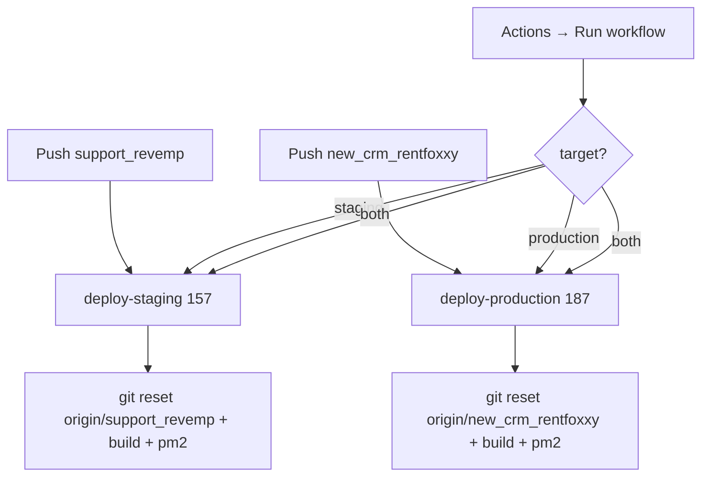

# CI/CD — GitHub Actions → Separate branch → separate VPS

Each branch deploys to **one** server. Pushing `support_revemp` never touches 187; pushing `new_crm_rentfoxxy` never touches 157.

| Branch | Environment | Server | Auto deploy |
|--------|-------------|--------|-------------|
| **`support_revemp`** | staging | `157.173.221.119` | Yes — staging job only |
| **`new_crm_rentfoxxy`** | production | `187.77.187.213` | Yes — production job only |

| Domain (typical) | App |
|------------------|-----|
| https://staging.rentfoxxy.com | Admin CRM (`frontend`) on 157 |
| https://staging.rentfoxxy.com/api | Backend API (`backend`) on 157 |
| https://customer.rentfoxxy.com | Customer portal |
| https://vendor.rentfoxxy.com | Vendor portal |

**Workflow file:** `.github/workflows/deploy.yml`  
**Staging VPS path:** `/var/www/crm_rentfoxxy_staging` (branch `support_revemp`)  
**Production VPS path:** `/var/www/crm_rentfoxxy` (branch `new_crm_rentfoxxy`)  
**Each VPS keeps its own** `backend/.env` (DB, URLs, API keys).

---

## Deployment flow



**Jobs are independent** — no staging → production chain.  
**Concurrency:** separate per branch/target so 157 and 187 do not block each other.  
**Safety:** remote script uses `set -euo pipefail`. If install/build fails, PM2 is not restarted.

---

## 1. GitHub Environments + Secrets

### Create environments

GitHub → **Settings → Environments** → create:

1. `staging`
2. `production` (recommended: enable **Required reviewers** so prod needs approval)

### Secrets on **each** environment

Add these three secrets **inside** the environment (not only at repo level), with **different values** per server:

| Secret | Staging example | Production example |
|--------|-----------------|--------------------|
| `VPS_HOST` | `157.173.221.119` | `187.77.187.213` |
| `VPS_USER` | `root` (or `deploy`) | `root` (or `deploy`) |
| `VPS_SSH_KEY` | Private key PEM | Same or separate private key |

> Do **not** commit private keys or `.env` files.

### Migrate from old single-server secrets

If you already have repo-level `VPS_HOST` / `VPS_USER` / `VPS_SSH_KEY` pointing at `187.77.187.213`:

1. Create Environments `staging` and `production`
2. Put **staging** secrets → `157.173.221.119`
3. Put **production** secrets → `187.77.187.213`
4. Optionally delete the old repo-level secrets so the wrong host cannot be used by accident

---

## 2. SSH key setup

### Generate a deploy key (local)

```bash
ssh-keygen -t ed25519 -C "github-actions-deploy" -f ~/.ssh/crm_rentfoxxy_deploy -N ""
```

- Private → GitHub Environment secret `VPS_SSH_KEY` (staging and/or production)
- Public → install on **both** VPS `authorized_keys` (or use one key per server)

### Install public key on a VPS

```bash
ssh YOUR_USER@YOUR_VPS_IP
mkdir -p ~/.ssh && chmod 700 ~/.ssh
nano ~/.ssh/authorized_keys   # paste .pub line
chmod 600 ~/.ssh/authorized_keys
```

### Test both servers

```bash
ssh -i ~/.ssh/crm_rentfoxxy_deploy root@157.173.221.119 "echo staging-ok"
ssh -i ~/.ssh/crm_rentfoxxy_deploy root@187.77.187.213 "echo production-ok"
```

---

## 3. VPS one-time setup (each server)

### Production (187) — `new_crm_rentfoxxy`

```bash
sudo mkdir -p /var/www/crm_rentfoxxy
sudo chown -R $USER:$USER /var/www/crm_rentfoxxy
cd /var/www
git clone -b new_crm_rentfoxxy https://github.com/YOUR_ORG/crm_rentfoxxy.git crm_rentfoxxy
```

### Staging (157) — `support_revemp`

```bash
sudo mkdir -p /var/www/crm_rentfoxxy_staging
sudo chown -R $USER:$USER /var/www/crm_rentfoxxy_staging
cd /var/www
git clone -b support_revemp https://github.com/YOUR_ORG/crm_rentfoxxy.git crm_rentfoxxy_staging
```

If staging already exists on `new_crm_rentfoxxy`, switch once:

```bash
cd /var/www/crm_rentfoxxy_staging
git fetch origin
git checkout support_revemp
git reset --hard origin/support_revemp
```

### Backend environment (per server — different values)

```bash
cp backend/.env.example backend/.env
nano backend/.env
```

Adjust domains/DB for each server.

### First PM2 start

```bash
cd /var/www/crm_rentfoxxy/backend   # or crm_rentfoxxy_staging/backend
npm ci --omit=dev
pm2 start ecosystem.config.cjs --only crm-backend
pm2 save
pm2 startup
```

---

## 4. How to run deployments

### Automatic (branch-gated)

| Push to | What runs | What does **not** run |
|---------|-----------|------------------------|
| `support_revemp` | Deploy staging (157) | Production (187) |
| `new_crm_rentfoxxy` | Deploy production (187) | Staging (157) |

### Manual

GitHub → **Actions** → **CI/CD Deploy to VPS** → **Run workflow**:

| Target | Result |
|--------|--------|
| `staging` | 157 only (`origin/support_revemp`) |
| `production` | 187 only (`origin/new_crm_rentfoxxy`) |
| `both` | Both jobs in parallel (independent) |

---

## 5. Verify

```bash
# Staging (157)
ssh root@157.173.221.119 "cd /var/www/crm_rentfoxxy_staging && git branch --show-current && pm2 status"

# Production (187)
ssh root@187.77.187.213 "cd /var/www/crm_rentfoxxy && git branch --show-current && pm2 status"
```

---

## 6. Troubleshooting

| Issue | Fix |
|-------|-----|
| Wrong server updated | Check Environment secrets: staging=`157…`, production=`187…` |
| Push to support_revemp also hit 187 | Old workflow — ensure latest `deploy.yml` is on the default branch GitHub uses for workflows |
| Staging resets wrong branch | VPS must track `support_revemp`; workflow uses `git reset --hard origin/support_revemp` |
| SSH permission denied | Environment `VPS_SSH_KEY` / `VPS_USER` / `authorized_keys` |
| Build OOM | Add swap on that VPS |
| CORS / wrong API URL | Fix that server’s `backend/.env` |

### Manual rollback on a VPS

```bash
cd /var/www/crm_rentfoxxy   # or crm_rentfoxxy_staging
git log --oneline -5
git reset --hard <previous-good-commit>
# rebuild frontends + pm2 restart, or re-run workflow
```

---

## 7. Security checklist

- [ ] Separate Environment secrets for staging vs production
- [ ] Production Environment has required reviewers (optional but recommended)
- [ ] Deploy SSH key is deploy-only
- [ ] `backend/.env` never committed
- [ ] Firewall: 22 / 80 / 443 only
- [ ] PostgreSQL not public

---

## 8. Files reference

| File | Purpose |
|------|---------|
| `.github/workflows/deploy.yml` | Branch-separated dual VPS deploy |
| `backend/ecosystem.config.cjs` | PM2 process definition |
| `deploy/CI_CD_SETUP.md` | This document |
