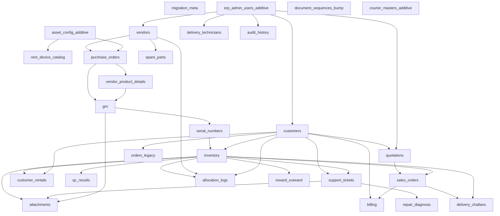

# Migration Dependency Order

> Generated: 2026-06-23T17:26:39.533Z
> Calculated from FK relationships and business workflow dependencies.

## Execution Order

| Step | Module | Depends On | ERP Sources | CRM Targets |
| --- | --- | --- | --- | --- |
| 000 | migration_meta | — |  |  |
| 002 | erp_admin_users_additive | — | admins | users (additive only) |
| 004 | document_sequences_bump | — | last_unique_number | sm_document_sequences (monotonic bump only) |
| 005 | asset_config_additive | — | brands, attributes, bundle_management | asset_config_* (insert missing only), laptop_catalog |
| 006 | vendors | 002 | sellers | vendors, vendor_shops |
| 007 | customers | 002 | customers, billing_addresses, shipping_addresses | customers, customer_addresses, customer_documents |
| 008 | courier_masters_additive | — | courier_details, issue_types | sm_courier_details, support_issue_categories (insert missing) |
| 009 | rent_device_catalog | 005 | rent_devices | rent_devices |
| 010 | purchase_orders | 006, 005 | purchase_orders | vendor_purchase_orders |
| 011 | vendor_product_details | 010 | product_details | vendor_product_details |
| 012 | grn | 010, 011 | goods_received_notes, goods_received_notes_parts | vendor_goods_received_notes, grn_* |
| 013 | serial_numbers | 012 | serial_numbers, serial_number_parts, serial_numberOnly | vendor_serial_numbers, part_instances |
| 014 | inventory | 013, 007 | inventory, npa_assets, assigned_assets | inventory, vendor_product_inventory |
| 015 | spare_parts | 006 | spare_parts, spare_parts_po | spare_parts, vendor_spare_parts_* |
| 016 | quotations | 007, 002 | quotations | sales_quotations |
| 017 | sales_orders | 016, 014 | sales_orders | sales_order_lines, sales_order_serials, sales_order_payments |
| 018 | orders_legacy | 007 | orders, order_details | orders, order_items |
| 019 | customer_rentals | 014, 007 | customer_rent_devices | customer_inventory |
| 020 | delivery_challans | 017, 014 | delivery_challans, pod_submissions, qc_truetech_delivery_challans | delivery_challan_lines, dc_qc_tickets, demo_agreements |
| 021 | delivery_technicians | 002 | delivery_men | delivery_technicians |
| 022 | qc_results | 014 | qc, qc_logs | qc_results, qc_photos (stages preserved) |
| 023 | support_tickets | 007, 014 | complaints_ticket, support_tickets, support_ticket_convs | support_tickets, support_ticket_items, tickets |
| 024 | repair_diagnosis | 023 | repair_logs, damage_parts_amount | repair_logs, diagnosis_*, ticket_parts |
| 025 | billing | 007, 017 | billing_manager, invoices, customer_credit_note, credit_and_debit_note, split_rent_billing | customer_invoices, customer_credit_notes, vendor_debit_notes, einvoice_records |
| 026 | allocation_logs | 014, 006, 007 | allocation_logs | allocation_logs |
| 027 | inward_outward | 014 | inward_outward | inward_outward |
| 028 | audit_history | 002 | customer_audit_logs, serial_number_update_logs | ttspl_audit_log, vendor_serial_number_audit |
| 030 | attachments | 014, 023, 012 | file_path columns across tables | photos, customer_documents, qc_photos |

## Dependency Tree (Mermaid)

## Rules

1. `erp_id_map` must be populated before any child FK remap.
2. Never insert CRM rows with ERP IDs directly — always map via `erp_id_map(entity, erp_id) → crm_id`.
3. CRM sequences (`SERIAL`) must be advanced after bulk insert.
4. Auth tables (`auth.*`) are **not** migrated from ERP OAuth/Sanctum.
5. **AUTH/RBAC preserved** — see `AUTH_TABLES.md`; no roles/permissions/teams import.
6. **System config preserved** — see `SYSTEM_TABLES.md`; additive merge only where noted.
7. ERP admins → CRM users **additive only** (match by email, never overwrite existing users).
8. Existing CRM seed data must be merged additively — never truncate business or auth tables.
